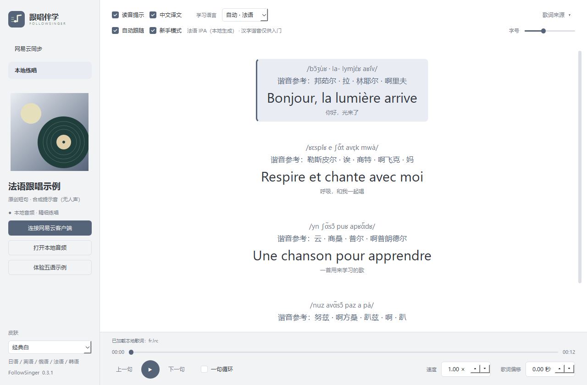
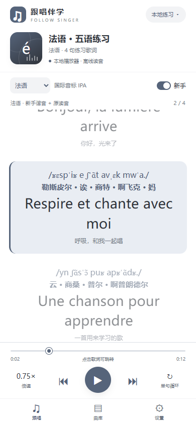

# 跟唱伴学 · FollowSinger

日语、英语、俄语、法语、韩语歌词跟唱工具，支持 **Windows 和 Android**。把原文、读音提示和中文译文放在一起，边听边练；可以打开本地歌曲，也可以跟随网易云音乐。

参考 [咏伴 · Utatomo](https://github.com/AsaMisogi/Cloudmusic-Lyrics-Singing) 的思路制作，主要是为了方便自己学唱外语歌。除了假名、罗马音和音标，也加了可选的汉字谐音，让完全不认识外语读音的新手能先尝试跟着唱一遍。

读音在本地生成，不需要使用网易云的注音。自动注音和汉字谐音都可能出错，请结合原唱核对。

[下载 Windows 版](https://github.com/hy0713/neteasemusicfollowsinger/releases/tag/v0.3.1) · [下载 Android 版](https://github.com/hy0713/neteasemusicfollowsinger/releases/tag/android-v0.1.0) · [问题反馈](https://github.com/hy0713/neteasemusicfollowsinger/issues)

## 下载与安装

| 平台 | 当前版本 | 下载文件 | 系统要求 |
| --- | --- | --- | --- |
| Windows | 0.3.1 | [FollowSinger-0.3.1-windows-x64.zip](https://github.com/hy0713/neteasemusicfollowsinger/releases/download/v0.3.1/FollowSinger-0.3.1-windows-x64.zip) | Windows 10 / 11，64 位 |
| Android | 0.1.0 测试版 | [FollowSinger-Android-0.1.0.apk](https://github.com/hy0713/neteasemusicfollowsinger/releases/download/android-v0.1.0/FollowSinger-Android-0.1.0.apk) | Android 8.0 及以上 |

### Windows

1. 下载 ZIP，完整解压到有写入权限的文件夹，不要在压缩包里直接运行。
2. 打开解压后的 `FollowSinger` 文件夹，双击 **`FollowSinger.exe`**。
3. 点击「体验五语示例」，或「打开本地音频」开始练习。

便携版已包含 Python、Qt、离线词库和发音引擎，无需安装 Python。移动程序时请保留整个文件夹，尤其是 `_internal` 目录。BAT 文件仅用于源码开发。

### Android

1. 下载 APK，在手机上打开；按系统提示允许该来源安装应用。
2. 首次打开可以点击「体验法语跟唱」。
3. 在「曲库」中导入音频和歌词，或开启网易云同步。

请保持 Android System WebView / Chrome 为已更新版本。当前 APK 使用调试签名，尚未上架应用商店；**真机安装与网易云联动仍待验收**。详细操作见 [手机版说明](android/README.md)。

## 功能

- **五语读音**：日语假名 / 罗马音、英语 IPA、俄语拉丁转写、法语 IPA、韩语罗马字；支持自动识别和手动选择语言。
- **新手模式**：默认关闭，开启后额外显示近似汉字谐音，例如 `Hi → 嗨`、`Bonjour → 邦茹尔`。原读音和译文仍然保留。
- **逐句跟唱**：按 LRC 时间高亮当前句，点击歌词定位、上一句 / 下一句、单句循环、歌词时间偏移。
- **慢速练习**：本地音频支持 0.5–1.5 倍速；网易云模式取决于客户端开放的控制能力。
- **网易云同步**：识别正在播放的歌曲、匹配公开歌词；也可输入歌曲 ID 或链接获取歌词。
- **本地练习**：导入自己的音频、原文 LRC 和中文译文 LRC，读音生成可离线使用。
- **五种皮肤**：时尚绿、护眼黄（米黄色）、海浪蓝、经典白、夜间黑，默认经典白。
- **显示设置**：调整歌词字号，选择是否显示读音、中文译文与新手谐音。

| 语言 | 普通模式读音 | 说明 |
| --- | --- | --- |
| 日语 | 假名 / 罗马音 | 使用本地词典转换，可切换显示 |
| 英语 | 国际音标 IPA | Windows 使用美式词典；Android 使用离线发音引擎 |
| 俄语 | 拉丁转写 | Windows 普通模式不标重音 |
| 法语 | 国际音标 IPA | 本地发音引擎生成，无需联网 |
| 韩语 | 罗马字转写 | Windows 普通模式不处理跨音节音变 |

## 界面示例

Windows：法语音标、新手谐音与中文译文，经典白皮肤。



Android：竖屏跟唱界面、倍速与单句循环。下图是手机尺寸的浏览器界面预览，非真机截图。



截图使用随包提供的原创短句和合成提示音，示例不含真人演唱。

## 跟随网易云音乐

### Windows

1. 在网易云 Windows 客户端播放歌曲，再点击本程序左侧「网易云同步」。
2. 普通连接通过 Windows 媒体会话读取歌曲信息；若客户端没有提供时间轴，从托盘**完整退出网易云**。
3. 点击「连接网易云客户端」，确认已退出后选择 `cloudmusic.exe`，等待状态显示「客户端直连」。
4. 在网易云切歌，程序会尝试匹配歌词。匹配失败时展开顶部「歌词来源」，输入歌曲 ID 或链接，点击「获取歌词」。

声音由网易云客户端播放。播放、暂停、定位和倍速是否可用取决于客户端提供的能力，不支持的控件会禁用。直连适配网易云 3.x 桌面版；客户端升级可能影响连接。

直连使用本机 `127.0.0.1:9222` 调试端口，不修改网易云安装文件。重新启动直连会中断当前播放；要停止直连，完整退出网易云，再正常启动即可。

### Android

1. 打开「曲库 → 网易云同步 → 开启网易云播放同步」。
2. 在系统「通知使用权」页面启用「跟唱伴学 · 网易云播放同步」。
3. 去网易云播放歌曲，再返回本程序。

手机版只连接网易云的媒体会话。播放、暂停和定位按会话能力启用；远端倍速还需要 Android 12 及以上，并且网易云明确提供倍速动作。不同客户端版本、手机系统和后台策略可能影响同步，当前尚未完成真机联动验收。

## 打开本地歌曲

### Windows

点击「打开本地音频」，选择自己的音频文件。程序自动寻找同目录下的同名歌词，例如：

```text
我的歌曲.mp3
我的歌曲.lrc
我的歌曲.zh.lrc
```

译文也可以命名为 `我的歌曲.trans.lrc`。手动导入时，展开顶部「歌词来源」，选择「导入原文」或「导入译文」。歌词支持 UTF-8、UTF-16 和 GB18030 编码，音频能否播放取决于系统解码器。

### Android

在「曲库 → 打开音频」选择音频，再通过「导入歌词」和「导入中文译文 LRC」分别选择文件。手机版使用系统文件选择器授权，不自动读取音频旁边的同名歌词，也不需要整个存储空间的访问权限。

本地播放后可切到后台，通过通知栏播放 / 暂停；关闭最近任务会停止本地播放。

## 常用操作

| 操作 | Windows | Android |
| --- | --- | --- |
| 播放 / 暂停 | 底部播放按钮或空格 | 底部播放按钮 |
| 跳到某句 | 点击歌词 | 点击歌词 |
| 上一句 / 下一句 | 底部按钮 | 底部按钮 |
| 单句循环 | 勾选「一句循环」 | 点击「单句循环」 |
| 调整倍速 | 底部「速度」 | 底部「倍速」 |
| 切换读音语言 | 顶部「学习语言」 | 跟唱页顶部语言选择 |
| 开启汉字谐音 | 顶部「新手模式」 | 跟唱页顶部「新手」 |
| 更换皮肤 | 左侧底部「皮肤」 | 「设置」 |
| 调整歌词时间 | 底部「歌词偏移」 | 「设置」中的歌词延迟 |

Windows 文本输入框中的空格保留正常输入。网易云模式中的定位、循环与倍速受客户端能力限制。

## 读音与歌词说明

读音是文本转换得到的练习提示，不是对歌手演唱做语音识别。日语多音字、英语连读、俄语重音、法语连音 / 鼻元音以及韩语音变，可能与自动结果不同。两端使用的词典和引擎也有差异，读音不保证完全一致。

汉字谐音只用于第一遍入门：忽略汉字声调，不把它当成翻译。普通话无法完整表达所有外语发音，建议结合原唱听音，逐渐改用假名、罗马音或 IPA。

本项目使用逐行 LRC 时间，不提供逐字高亮。单句循环以相邻歌词行作为边界；网易云远端循环要求可定位且句长至少 0.8 秒，Windows 本地循环要求至少 0.1 秒。手机版远端循环只在跟唱页处于前台时执行。

## 本地数据与联网

- 读音词典、发音引擎和新手谐音规则随程序提供，本地音频练习无需联网。
- 联网用于网易云公开歌曲搜索和歌词获取；程序不索取登录 Cookie，不下载受保护音频。
- Windows 偏好保存在程序目录的 `data/preferences.json`，日志在 `data/logs/`。更新时退出旧程序，完整解压新包，可复制原 `data/` 保留偏好；请使用新包自己的 `_internal`。
- Android 设置保存在应用内；通知使用权用于网易云播放同步，不读取或保存聊天通知。

## 从源码运行与打包

### Windows

需要 Python 3.12，在项目根目录运行：

```powershell
python -m venv .venv
.venv\Scripts\python.exe -m pip install -r requirements.txt
.venv\Scripts\python.exe main.py
```

也可使用源码目录的 `start.bat`。构建 Windows 便携包：

```powershell
.venv\Scripts\python.exe -m pip install "pyinstaller>=6.16,<7"
.venv\Scripts\python.exe scripts/build_release.py --dist-dir dist/0.3.1
.venv\Scripts\python.exe scripts/zip_release.py --version 0.3.1
```

### Android

构建环境、命令与测试方法见 [Android 开发说明](android/README.md#构建)。APK 包含离线词典与引擎，日常使用无需 Python、服务器或浏览器窗口。

验证范围与历史结果见 [验证记录](docs/verification.md) 和 [Android 构建报告](android/BUILD_REPORT.md)。

## 来源与许可证

功能思路参考 [AsaMisogi / 咏伴 · Utatomo](https://github.com/AsaMisogi/Cloudmusic-Lyrics-Singing)。本仓库的界面、歌词模型、语言扩展与练习流程独立实现，项目采用 [GPL-3.0-only](LICENSE)。

离线读音使用 pykakasi、CMU 发音词库、eSpeak NG，以及手机版的 kuromoji.js / ephone。第三方组件保留各自许可证与所需的对应源码，详见 [桌面版第三方说明](vendor/README.md)、[ephone 来源](vendor/ephone/README.md) 和 [手机版说明](android/README.md#离线词典与许可证)。

歌曲、歌词、译文与在线服务内容归各自权利人。如遇问题，可以在 [GitHub Issues](https://github.com/hy0713/neteasemusicfollowsinger/issues) 中提供系统版本、程序版本、歌曲 ID 和复现步骤；请勿附带登录凭据或私人文件。
